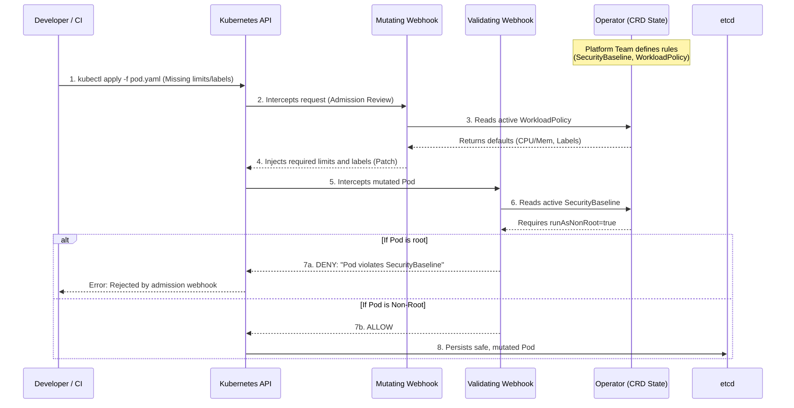

# Platform Governance Operator

## Overview

The **Platform Governance Operator** is a Kubernetes Operator developed in Go using `controller-runtime`. It shifts the paradigm of cluster governance from "passive CI/CD checks" to **active, in-cluster enforcement** through Custom Resource Definitions (CRDs) and Admission Webhooks.

### The "Why"

In enterprise Kubernetes environments, leaving security and resource configuration entirely to the developer ("YOLO Kubernetes") results in insecure workloads, lack of visibility, and excessive resource consumption. 

This operator acts as an **automated platform contract**:
1. **Secure by Default**: Actively rejects workloads that attempt to run as `root` or without a read-only filesystem.
2. **Resilience & Cost Control**: Automatically injects resource `requests` and `limits` if the developer omits them, ensuring a rogue pod doesn't bring down an entire node.
3. **Guaranteed Observability**: Injects OpenTelemetry environment variables and configurations directly into containers on-the-fly, ensuring all traffic generates traces without requiring developers to modify their Dockerfiles.
4. **Organizational Governance**: Enforces mandatory labels (like `cost-center`) on all resources to enable financial chargeback.

---

## Architecture & Component Interaction

The operator manages the platform contracts and intercepts API requests to enforce them.

### 1. The Contracts (CRDs)
- **`SecurityBaseline`**: Defines and ensures minimum security standards (e.g., `runAsNonRoot`, `readOnlyRootFilesystem`).
- **`WorkloadPolicy`**: Enforces resource limits (`requests`/`limits`) and mandatory organizational labels (e.g., `cost-center`, `owner`).
- **`TelemetryProfile`**: Automates the injection of observability configurations (e.g., tracing agents or OpenTelemetry environment variables).

### 2. Interaction Flow



---

## Real-world Example

Imagine the platform team deploys the following policies:

```yaml
# 1. Workload Policy
apiVersion: core.platform.f3nr1r.io/v1alpha1
kind: WorkloadPolicy
metadata:
  name: standard-policy
spec:
  mandatoryLabels:
    - cost-center
  defaultRequests:
    cpu: 100m
    memory: 128Mi

---
# 2. Telemetry Profile
apiVersion: core.platform.f3nr1r.io/v1alpha1
kind: TelemetryProfile
metadata:
  name: default-tracing
spec:
  tracingEndpoint: "http://otel-collector.observability:4317"
  injectEnvVars: true
```

**The Developer deploys a "careless" Pod:**
```yaml
apiVersion: v1
kind: Pod
metadata:
  name: my-app
spec:
  containers:
  - name: app
    image: nginx
```

**The automatic result (What actually reaches Kubernetes):**
Thanks to the `Platform Governance Operator`, before the pod starts, it is modified on-the-fly to look like this:

```yaml
apiVersion: v1
kind: Pod
metadata:
  name: my-app
  labels:
    cost-center: "default-value-required" # Injected!
spec:
  containers:
  - name: app
    image: nginx
    resources:
      requests:
        cpu: 100m      # Injected!
        memory: 128Mi  # Injected!
    env:
      - name: OTEL_EXPORTER_OTLP_ENDPOINT # Injected!
        value: "http://otel-collector.observability:4317"
```
*(Furthermore, if the pod did not comply with the `SecurityBaseline`, it wouldn't even be created, returning a clear message to the developer in their terminal).*

---

## Getting Started

### Prerequisites
- go version v1.24+
- docker version 17.03+.
- kubectl version v1.11.3+.
- Access to a Kubernetes cluster (e.g., kind, k3d).

### To Deploy on the cluster
**Build and push your image to the location specified by `IMG`:**
```sh
make docker-build docker-push IMG=<some-registry>/platform-governance-operator:tag
```

**Install the CRDs into the cluster:**
```sh
make install
```

**Deploy the Manager to the cluster:**
```sh
make deploy IMG=<some-registry>/platform-governance-operator:tag
```

### Running Tests
To run integration and unit tests using `envtest`:
```sh
make test
```

To run end-to-end tests locally using `kind`:
```sh
./scripts/e2e-test.sh
```

## Documentation

- [Architecture Decision Records (ADRs)](./docs/adrs/)
- [Blog: Designing Platform Contracts with CRDs](./docs/blog/01-designing-platform-contracts-with-crds.md)

## License

Copyright 2026.

Licensed under the Apache License, Version 2.0 (the "License");
you may not use this file except in compliance with the License.
You may obtain a copy of the License at

    http://www.apache.org/licenses/LICENSE-2.0
